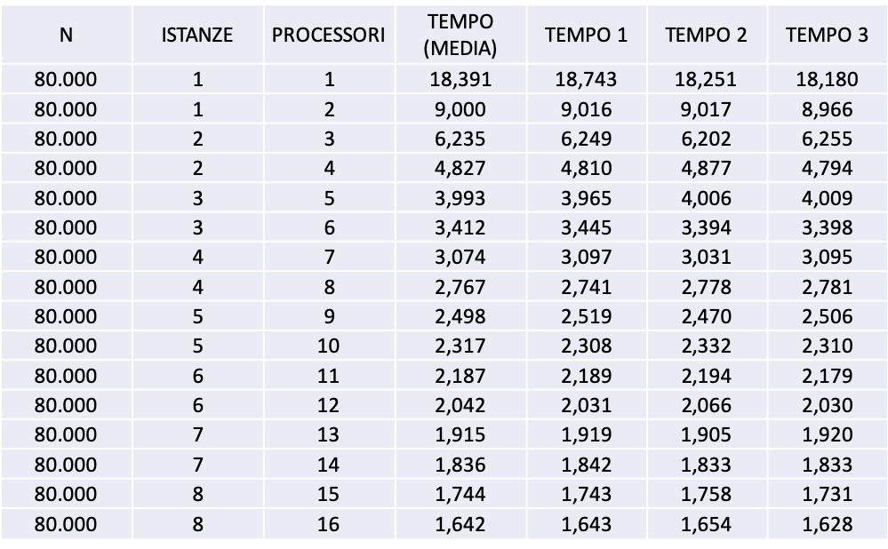
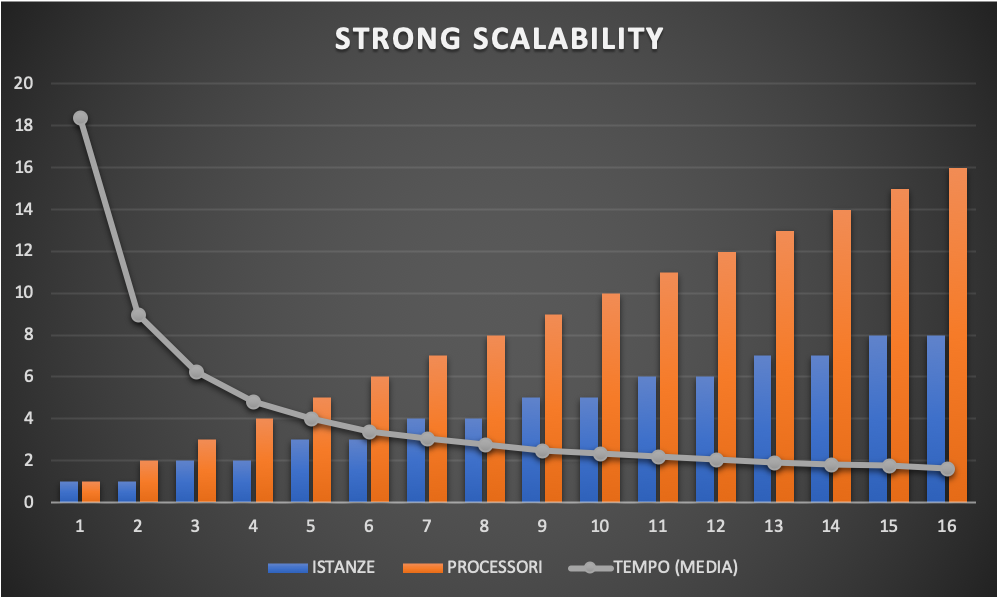
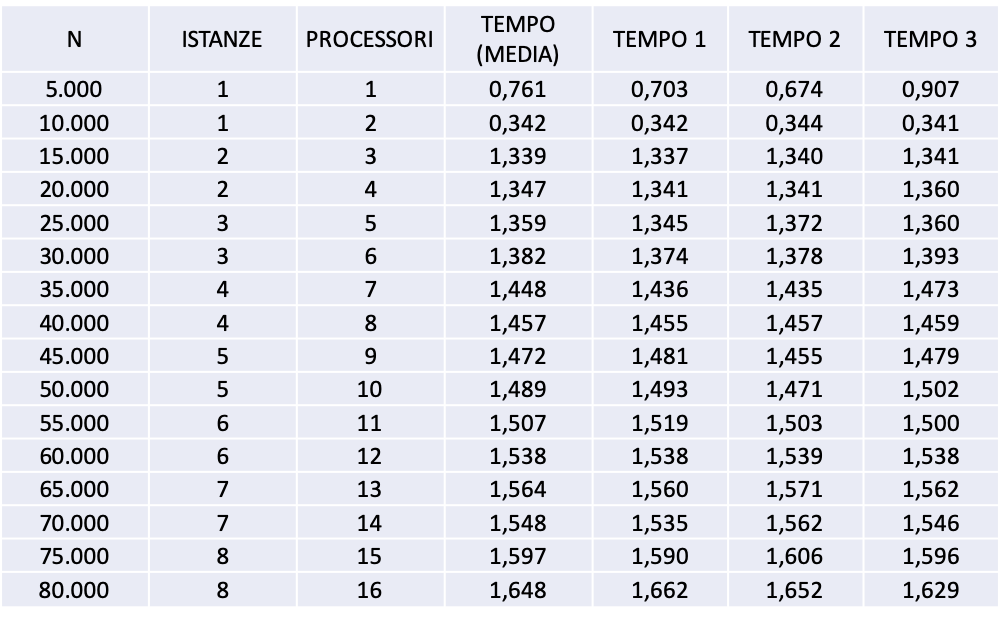
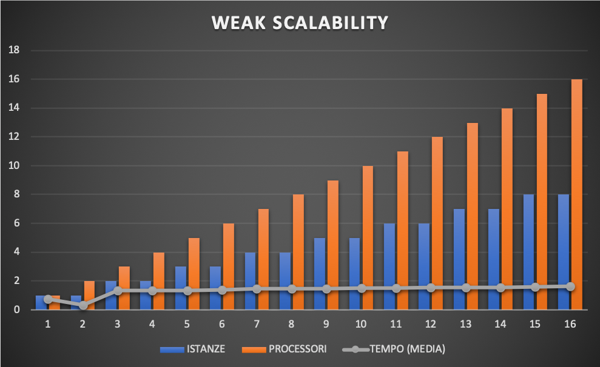

# MPI Parallel Words Count

Progetto accademico presentato da **Antonio Quirito**

Corso di laurea magistrale in **Cloud Computing**

Esame di **Programmazione concorrente, parallela e su cloud**

Insegnanti: **Vittorio Scarano, Carmine Spagnuolo**

Dipartimento di Informatica - Università degli Studi di Salerno (Italia)

## Descrizione del progetto

In questo progetto verrà usato OpenMPI per il conteggio delle parole in parallelo. Verrà utilizzata una struct che conterrà l’elenco delle parole ed il numero di volte che esse verranno ripetute.

## Benchmarking

1.	Fornire una soluzione al problema sfruttando il calcolo parallelo e sviluppare un programma C usando MPI.
2.	Confronta la soluzione su istanze Amazon AWS EC2 (t2.large). Test della soluzione utilizzando 1, 2, 3, 4, 5, 6, 7, 8 istanze.
3.	La scalabilità sia debole che forte deve essere analizzata:
- **Strong Scalability**: si applica mantenendo fissa la dimensione del problema ed aggiungendo di volta in volta più processori. Obiettivo: ridurre al minimo i tempi per la soluzione di un determinato problema.

- **Weak Scalability**: si applica mantenendo fisso il carico di lavoro per processore e aggiungendo più carico di lavoro all’aumentare dei processori (aumenta la dimensione complessiva del problema). Obiettivo: risolvere i problemi più grandi.

  

## Input files

Questo progetto è stato realizzato per leggere ed eseguire un conteggio delle parole su dei semplici file di testo

Esempio:

> Lorem ipsum dolor sit amet, consectetur adipiscing elit. Pellentesque aliquam neque ut semper aliquet. Nullam mollis arcu sed tortor eleifend, ut pharetra magna bibendum. Donec euismod ex eget laoreet ultrices. Quisque ac placerat mauris, non volutpat leo. Suspendisse nisi nibh, porttitor eget porttitor sed, tristique quis metus. Nullam non ipsum efficitur, varius nisi vel, tincidunt urna. In semper iaculis leo, quis commodo leo

## Descrizione dell'algoritmo

L’esecuzione dell’algoritmo avverrà in quattro passaggi:
1.	L’utente selezionerà i files da analizzare (da 1 a 16). Il master creerà un file output.txt contenente un elenco di tutte le parole analizzate.
2.	Il master invierà a tutti i processori un array, procRow, contenente esclusivamente le righe del file di output che ognuno di essi dovrà analizzare. Ad esempio se il file di output contiene 3000 parole, utilizzando due processori, il processore 1 analizzerà il file di output dalla parola in riga 1 alla parola in riga 1500 e il processore 2 analizzerà il file di output dalla parola in riga 1500 alla parola in riga 3000.
3.	Tutti i processori eseguiranno il word count locale delle parole analizzate ed invieranno il risultato al master.
4.	Il master riceverà le parole sommando i contatori delle parole uguali. Ad esempio se la parola “hello” compare 2 volte su un processore e 3 volte su un altro, il master dirà che “hello” comparirà 5 volte. Fatto questo, il master stamperà a video i risultati ottenuti e il tempo di esecuzione.

## Dettagli di implementazione

### Funzionalità MPI

In questo progetto sono state utilizzate le seguenti funzionalità MPI:
-	MPI_Bcast
-	MPI_Scatter
-	MPI_Send
-	MPI_Recv
-	MPI_Type_create_struct

## Tests and Results

I test sono stati eseguiti sul cluster Amazon AWS EC2, con 8 istanze (t2.large).
Ogni istanza ha 2 vCPU, quindi i test sono stati eseguiti aumentando il numero di processori di uno alla volta e aggiungendo gradualmente altre istanze (a partire da 1 istanza con 1 processore, fino a 8 istanze con 16 processori).
Il singolo file di input utilizzato per i test contiene:
- 5.000 parole
- 34.000 byte

In tutto i 16 files di input contengono
- 80.000 parole
- 544.000 byte

### Strong Scalability

Per i test sono sempre stati utilizzati tutti i 16 file:
Nella Strong Scalability, la dimensione del problema rimane invariata e gradualmente verranno aggiunti altri processori al cluster. I risultati sono i seguenti:

Passando dall’algoritmo sequenziale a quello parallelo, possiamo notare come il tempo di esecuzione praticamente si dimezza. Si noti inoltre come, passando da **2** a **8 processori**, il tempo di esecuzione sia diminuito di ben **6,2 secondi**, mentre passando da **8** a **16 processori**, il tempo di esecuzione sia diminuito di appena **1,1 secondi**.
Il seguente grafico mostra come l’algoritmo parallelo possa impiegare fino a **16,7 secondi** in meno rispetto all'algoritmo sequenziale.

### Weak Scalability

Per i test è stato utilizzato 1 file per ciascun processore, aumentando gradualmente la dimensione del problema.

Il grafico risultante mostra un tempo di esecuzione lineare.

C'è solo una piccola differenza nelle prime serie, ma la tendenza è molto stabile.

## Istruzioni

### Local Execution (Sequential)

All'interno della directory ***WordsCountSequential***, eseguire i seguenti comandi:

    gcc main.c -o main
    ./main NUMBER_OF_FILES

-	**NUMBER_OF_FILES**
Intero (da 1 a 16) per indicare i file che si vuol processare da *1.txt* a *16.txt*.

### Local Execution (Parallel)

All'interno della directory ***WordsCountParallel***, eseguire i seguenti comandi:

    mpicc main.c -o main
    mpirun -np NUMBER_OF_PROCESSORS main NUMBER_OF_FILES

-	**NUMBER_OF_PROCESSORS**
Numero di processori che MPI utilizzerà per l'esecuzione.
-	**NUMBER_OF_FILES**
Intero (da 1 a 16) per indicare i file che si vuol processare da *1.txt* a *16.txt*.

### Cluster Execution	

Prima di tutto creare un **machinefile**:

    pico machinefile

Scrivere all'interno del machinefile:

    localhost slots=2
    PRIVATE_SLAVE_IP1 slots=2
    PRIVATE_SLAVE_IP2 slots=2
    ...

-	**PRIVATE_SLAVE_IPn**
l’IP privato dell’istanza n.
-	**SLOTS**
Numero di core all’interno di ogni istanza.

Per eseguire il progetto, digitare il comando seguente:

    mpirun -np NUMBER_OF_PROCESSORS --hostfile machinefile ./main NUMBER_OF_FILES

-	**NUMBER_OF_PROCESSORS**
Numero di processori che MPI utilizzerà per l'esecuzione.
-	**HOSTFILE MACHINEFILE**
Sono gli indirizzi IP delle istanze da usare contenuti all’interno di machinefile.
-	**NUMBER_OF_FILES**
Intero (da 1 a 16) per indicare i file che si vuol processare da *1.txt* a *16.txt*.

